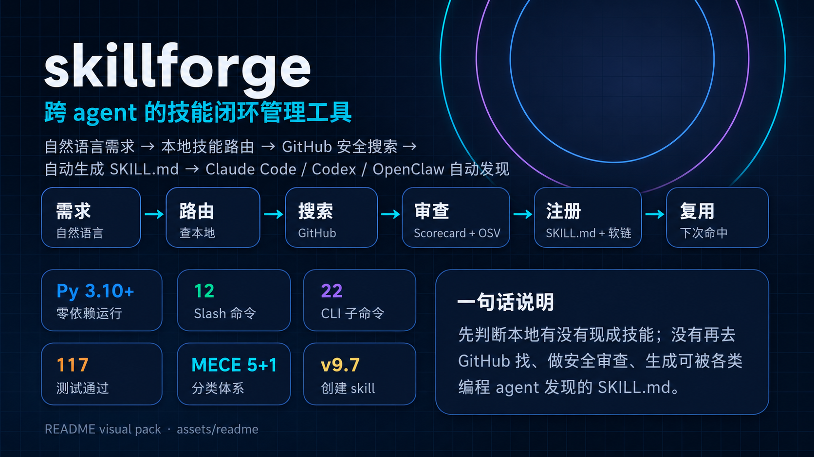
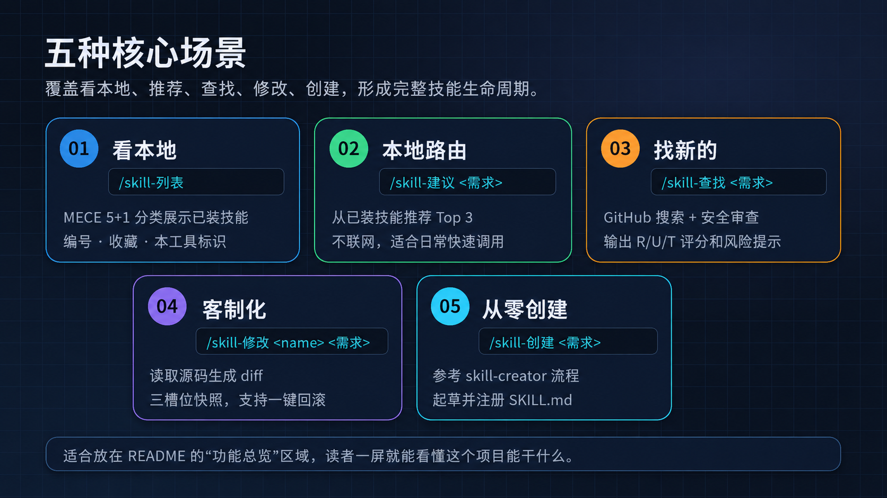
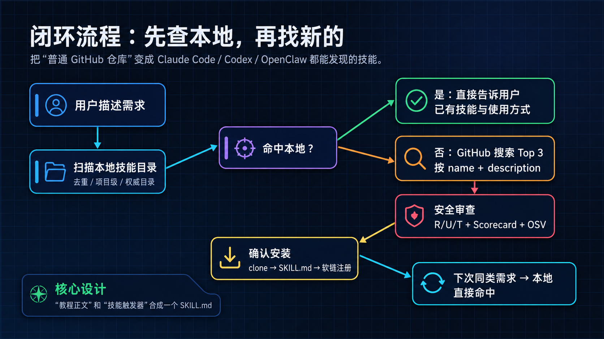
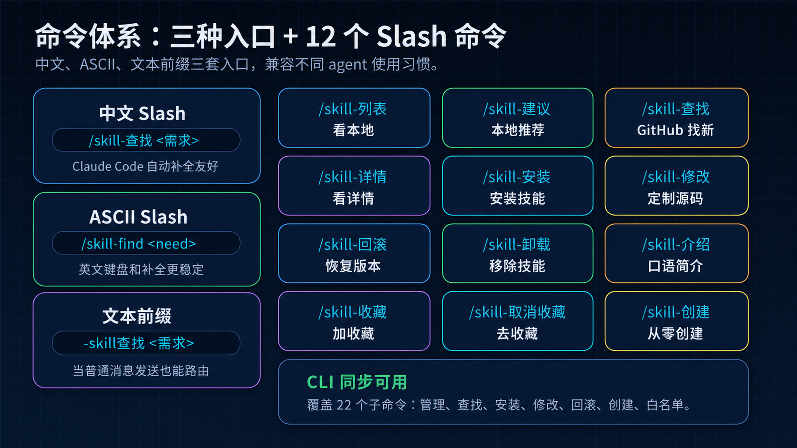
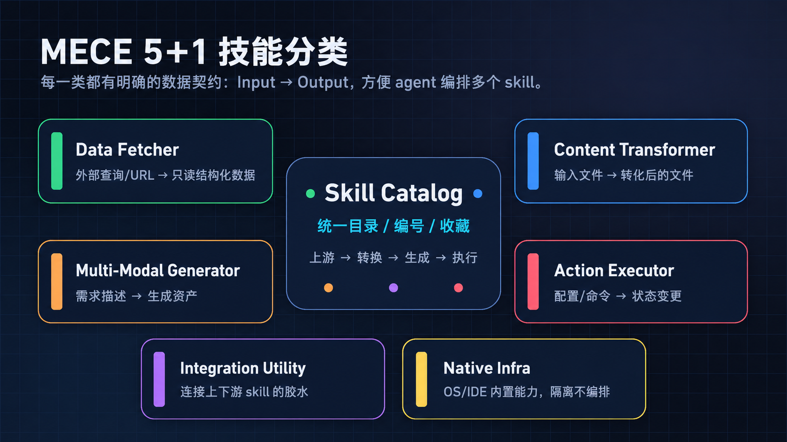
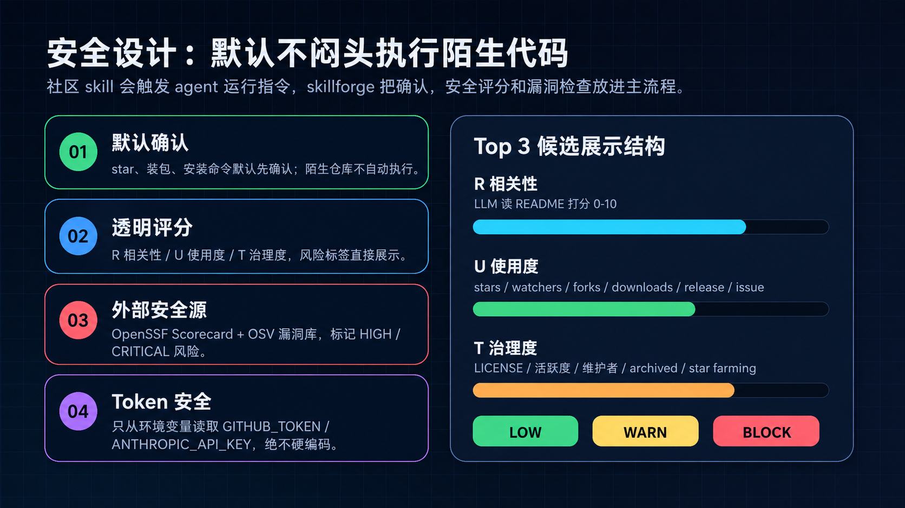
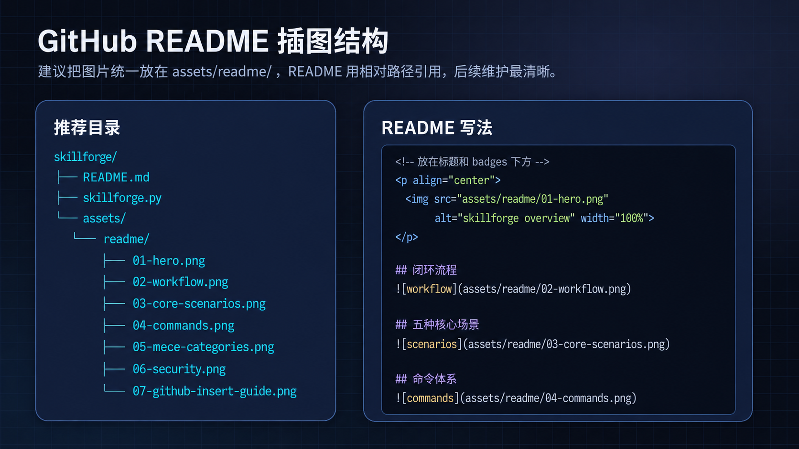

# skillforge — 跨 agent 的技能闭环管理工具

       

> **一句话**:用户用自然语言说需求 → 先查本地装没装过能干这事的技能 → 有就告诉他怎么用,没有就去 GitHub 找、安全审查、自动写成一个能被各 agent (Claude Code / Codex / OpenClaw) 发现的技能,**所有 LLM 推理由调用方 agent 自己做**;需要时**还能从零造一个新 skill**。

**零第三方运行时依赖**,单文件 `skillforge.py` (Python 3.10+ 标准库)。已本地实测跑通 12 个 slash 命令 + 22 个 CLI subcommand,117 unittest 全绿。

<p align="center">
  
</p>

## 快速开始

```bash
# 1. 装到本地
git clone https://github.com/t115601251-hue/skillforge.git
cd skillforge

# 2. 自部署:写自身 SKILL.md + 12 个 slash 模板(中文 + ASCII 别名 = 24 × 3 家 agent)
python skillforge.py self-install

# 3. 在 agent chat 里(或直接 CLI):
python skillforge.py catalog --brief    # 紧凑目录:MECE 5+1 分类,带编号 + 🏠/⭐
python skillforge.py suggest "去图背景"  # 自然语言路由 → 本地 Top 3(不联网)
python skillforge.py find "image OCR"   # 去 GitHub 找新的(LLM + 安全审)
```

**Token**:`find` / `install` / `find-data` / `deep-data` 联网命令需要 `GITHUB_TOKEN`(匿名 60/h 会打满);其它命令(`list`/`catalog`/`intro`/`detail`/`suggest`/`favorite`/`rollback`/`uninstall`/`create`)纯本地无需 token。`ANTHROPIC_API_KEY` 完全可选 —— v4 后 agent-as-LLM 架构下由调用方 agent 出 LLM 力。

## 五种核心场景

| 场景 | 命令 | 干什么 |
|---|---|---|
| **看本地** | `/skill-列表` | 按 **MECE 5+1** 分类紧凑展示 75+ 个 skill,带编号 · 🏠 标本工具 · ⭐ 标收藏 |
| **本地路由** | `/skill-建议 <需求>` | 从已装推 Top 3(Markdown 表 + "适合/不适合"),不联网 |
| **找新的** | `/skill-查找 <需求>` | 去 GitHub:token 检查 → 三角度改写 → Scorecard+OSV 安全审 → Top 3 (R/U/T 三维分打分明细) |
| **客制化** | `/skill-修改 <name> <需求>` | agent 读源码出 diff → 自动三槽位快照 → 应用 → 可一键回滚 |
| **从零创建** | `/skill-创建 <需求>` | 参考 Anthropic skill-creator 4 步流程,agent 起草 → 落盘到 3 家 agent + pristine 快照 |



---

## 1. 它解决什么问题

你同时用 Claude Code、Codex 这类编程 agent,它们都认同一种技能格式 `SKILL.md`(开放标准,启动时读每个技能的 `name`+`description`,需求匹配上才加载正文)。但有两个缺口:

1. 一个**普通 GitHub 仓库不是技能**——agent 不会自动把它当能力用。
2. 你不知道**自己到底装过哪些技能**,容易重复找、重复装。

skillforge 把这两件事接成一条闭环,并补上一个「先查本地」的前置闸门。

---

## 2. 闭环流程



```
用户描述需求
     │
     ▼
┌─────────────────────┐
│ 扫本地所有 agent     │   ~/.claude/skills、~/.codex/skills、
│ 技能目录(去重)     │   ~/.openclaw/skills、项目级 .*/skills、权威目录
└─────────┬───────────┘
          ▼
      命中本地?
     ╱        ╲
   是           否
   │             │
   ▼             ▼
告诉用户      GitHub 搜索(按 name+description,star 排序)
已经有了          │
怎么用            ▼
              你确认选哪个
                  │
                  ▼
              ⭐ star + 收藏(需你的 token,先确认)
                  │
                  ▼
              git clone 到权威目录
                  │
                  ▼
              检测安装方式(默认不自动执行陌生代码)
                  │
                  ▼
              生成 SKILL.md(description 写得"主动"以提升触发率)
                  │
                  ▼
              注册:软链到各 agent 目录(一处更新,处处生效)
                  │
                  ▼
          下次再问同样需求 → 直接命中本地,闭环闭合
```

关键设计点:**「写使用教程」和「让技能可被发现」是同一个产物**——生成的 `SKILL.md` 正文就是教程,frontmatter 的 `description` 就是触发器。

---

## 3. 命令全表 (v9.7)

### 12 个 slash 命令 (三种入口,agent 里都能用)

| 中文 | ASCII 别名 | 文本前缀 (v9.3.2) | 干嘛 |
|---|---|---|---|
| `/skill-查找 <需求>` | `/skill-find` | `-skill查找 <需求>` | 去 GitHub 找 Top 3,含 Scorecard/OSV 安全审 |
| `/skill-建议 <需求>` | `/skill-suggest` | `-skill建议 <需求>` | 从已装里推 Top 3,不联网 |
| `/skill-列表` | `/skill-list` | `-skill列表` | MECE 5+1 紧凑目录,带编号 + 🏠/⭐ |
| `/skill-详情 <编号\|name>` | `/skill-info` | `-skill详情 <编号>` | 看某项来源/版本快照/定制状态 |
| `/skill-安装 <target>` | `/skill-install` | `-skill安装 <target>` | 装一个 (target = 编号 / name / owner/repo) |
| `/skill-修改 <name> <需求>` | `/skill-modify` | `-skill修改 <name> <需求>` | agent 改源码,自动快照,显 diff 后应用 |
| `/skill-回滚 <name>` | `/skill-rollback` | `-skill回滚 <name>` | 回上一版 (swap);`--pristine` 回 GitHub 原版 |
| `/skill-卸载 <name>` | `/skill-uninstall` | `-skill卸载 <name>` | 删软链 + 数据搬 backups/ 不丢 |
| `/skill-介绍 <编号\|name>` | `/skill-intro` | `-skill介绍 <n>` | agent 写一段口语化中文使用说明 |
| `/skill-收藏 <编号\|name>` | `/skill-favorite` | `-skill收藏 <n>` | ⭐ 加收藏 (v9.6,本地 favorites.json) |
| `/skill-取消收藏 <编号\|name>` | `/skill-unfavorite` | `-skill取消收藏 <n>` | 去 ⭐ |
| `/skill-创建 <需求>` | `/skill-create` | `-skill创建 <需求>` | 从零造新 skill (v9.7,参考 Anthropic skill-creator) |
| `/skill-帮助` | `/skill-help` | `-skill帮助` | 命令表 |



**Catalog 图标含义**:🏠 本工具自身 (skillforge) · ⭐ 你收藏的 · ✨ 已被 modify 定制过

### 22 个 CLI subcommand (直接 `python skillforge.py <cmd>`)

```bash
# 已装管理
skillforge list [--brief|--full|--cat X|--lang zh|en]  # 分类展示,同 /skill-列表
skillforge catalog [--brief|--full|--lang zh|en]        # 手动重生成 CATALOG.md
skillforge detail <编号|name>                            # 单项详情
skillforge intro <编号|name>                             # 一段中文简介
skillforge which "<需求>"                                # 查本地有没有能干这事的
skillforge suggest "<需求>"                              # 本地 Top 3 推荐 (不联网)

# 联网 (需 GITHUB_TOKEN)
skillforge find "<需求>" [--simple|--repo owner/name|--yes|--install|--top N]
skillforge install <target> [--no-star|--install]
skillforge find-data "<q1>" "<q2>" "<q3>" --top N        # 三 query 拉候选 JSON
skillforge deep-data <full_name>...                     # 深读 README+Scorecard+OSV
skillforge render --file <ranking.json>                 # 展示 agent 出的 Top 3

# mutation
skillforge modify <name> "<需求>"                        # LLM 改源码,自动快照
skillforge modify-source <name>                          # dump 源到 JSON (给 agent)
skillforge modify-apply <name> --file <changes.json>     # 应用 agent 出的 changes
skillforge rollback <name> [--pristine]                  # swap previous,或回 pristine
skillforge uninstall <name>                              # 卸,数据搬 backups/
skillforge create --file <draft.json>                    # v9.7: 造新 skill 落盘

# 收藏 (v9.6)
skillforge favorite <编号|name>                          # ⭐ 收藏
skillforge unfavorite <编号|name>                        # 去 ⭐
skillforge favorite-list                                 # 列所有收藏

# 元管理
skillforge trust list|add|remove <owner...>              # 可信 owner 白名单
skillforge consolidate [--dry-run|--yes]                 # 合并同名物理副本
skillforge self-install                                  # 部署自身 + slash 模板到 3 家 agent
skillforge help                                          # bash 帮助
```

`which` 和 `find` 共用「扫本地 → 匹配」逻辑;`find` 只在没命中时往后走。

### find 的常用参数

| 参数 | 作用 |
|---|---|
| `--repo owner/name` | 跳过搜索,直接指定仓库 |
| `--top N` | 输出几个候选(默认 3;多搜阶段按 top*2 拉) |
| `--yes` | 非交互:自动确认 + 选第一个候选 |
| `--force-new` | 本地已有也强制装新的 |
| `--no-star` | 不点 star |
| `--install` | 允许执行检测到的安装命令(默认**不**自动执行) |
| `--no-register` | 不注册到 agent 目录 |
| `--copy` | 注册用复制而非软链 |
| `--simple` | 跳过 LLM 流水线,走老 keyword 搜索路径(快,$0,质量低) |
| `--no-readme` | 跳过 README 深读 + close-rate + 下载量(中速) |

### LLM 增强 find 流水线(默认)

当 `ANTHROPIC_API_KEY` + `GITHUB_TOKEN` 都设了时,`find` 走 9 步流水线:

1. LLM 把中文需求改写成 3 个英文 query(功能/工具/技术栈三角度)
2. 三个 query 各搜 GitHub,合并去重得 10-15 候选
3. 对每个候选拉 `/repos/{x}` 元数据,算治理分 **T (0-100)** + 风险标签
4. LLM 粗排,挑出最相关的 5 个继续深读
5-6. 对 Top 5:fetch README + issue 闭合率 + 包月下载量(PyPI/npm/Crates)
7. 算使用度 **U (0-100)**,融合 stars/watchers/forks/下载量/release/闭合率
8. LLM 终排出 Top 3,带相关性 **R (0-10)** + 推荐级别 + 中文理由 + 风险列表
9. 渲染 Top 3 让你选

成本 ~$0.02 + 8-12s / find。详见 [specs/2026-06-30-skill-search-quality.md](specs/2026-06-30-skill-search-quality.md) 和 [plans/2026-06-30-skill-search-quality.md](plans/2026-06-30-skill-search-quality.md)。

**降级**:无 `ANTHROPIC_API_KEY` 时跳过 LLM,改用 `0.6*U + 0.4*T` 启发式排序;R 显示为 `--`。无 `GITHUB_TOKEN` 时匿名(60/h 通常不够),建议设一个。

### Adoption(自动发现已有手写 SKILL.md)

`find` 在生成 SKILL.md 前会先在各 agent 目录里看有没有**同名、非软链、description ≥ 80 字符**的 SKILL.md。如果有,说明你自己手写过精品版,默认会**采用它作为权威**(复制到 `SKILLFORGE_HOME`,原目录搬到 `~/.skillforge/backups/`),再软链回各 agent 目录。这保证三个 agent 看到的 description 完全一致,而不是被 skillforge 的模板兜底覆盖。

### Trust 白名单(自动装信任仓库)

```bash
skillforge trust add anthropic microsoft editech-dev   # owner 级,匹配所有该作者仓库
skillforge trust add owner/specific-repo               # 单仓库级
skillforge trust list
skillforge trust remove anthropic
```

`find` 检测到安装命令时,若 owner 在白名单内,等价于自动加了 `--install`(仍会确认,加 `--yes` 才跳过)。文件:`~/.skillforge/trusted.txt`,可手工编辑,`#` 开头行为注释。

### 三种入口 (v9.3.2)

同一个命令三种敲法都能触发:

1. **`/skill-中文`** (v9.3+, 原生 slash) — Claude Code 自动补全下拉框首选
2. **`/skill-english`** (v9.3+, ASCII 别名) — 自动补全下拉框比中文更友好
3. **`-skill中文 <参数>`** (v9.3.2+, 文本前缀) — 敲普通消息 agent 主动路由 (SKILL.md 里加了识别规则)

三种入口对照表和使用条件详见 [`SKILL.md`](https://github.com/t115601251-hue/skillforge/blob/main/skillforge.py#:~:text=%23%23%20%E6%80%8E%E4%B9%88%E7%94%A8)。

**⚠ 裸 `/skill`** 已废弃 (v9.3):容易与 agent 内置命令冲突,统一改用 `/skill-<X>` 形式。

### MECE 5+1 分类 (v9)

从 v8 的 27 emoji 分类升级到严格 MECE (Mutually Exclusive Collectively Exhaustive) 5+1 分类,每类都有明确的**数据契约** (Input ➡️ Output) 和**编排建议**:

| 类别 | 数据契约 | 编排位置 |
|---|---|---|
| 🟢 **Data Fetcher** | 外部查询/URL ➡️ 只读结构化数据 | 上游,输出流转给 Transformer |
| 🔵 **Content Transformer** | 输入文件 ➡️ 转化后的文件 | 纯本地变换,可多个串联 |
| 🔥 **Multi-Modal Generator** | 需求描述 ➡️ 生成资产 (图/音/视/代码) | 算力密集,生成全新资产 |
| ⚡ **Action Executor** | 配置/命令 ➡️ 外部系统状态变更 | 危险,前置需 dry-run/confirm |
| 🛠 **Integration Utility** | 上下游 skill I/O ➡️ 路由/桥接 | 兜底类,连接其它 skill 的胶水 |
| 🚫 **Native Infra (隔离)** | OS/IDE 内置能力 | 不参与业务 skill 编排 |



**紧凑目录 (v9.1)**:`catalog --brief` 默认输出"英文名 + ≤25 字中文一句释义"格式,74+ skill 目录压到 7.7 KB(比原描述压缩 80%),Read 一次就装得下。字典 `_BRIEF_TRANSLATIONS` 存 74 项 × zh/en 双语,新装 skill 走 fallback (取原描述首句)。

**编号 (v9.2)**:catalog 每项前带 `1.`~`75.` 连续编号,同时写到 `~/.skillforge/.last_list.json`,`/skill-详情 21` `/skill-info 31` 可直接用编号快捷。

**打分明细 (v9.5)**:`/skill-查找` 的 Top 3 输出把 R (相关性) / U (使用度) / T (治理度) 三维分展开成子指标,如:

```
U 使用 22/100
    = star:5.4/20(★21)  watch:3.5/20(👁4)  fork:3.2/15(🔱6)
      download:10.3/30(📥253/月)  release:0/10  close_rate:0/5
T 治理 40/100
    = LICENSE:0/20(无)  主分支:15/15(main)  近期活跃:0/15(108天前)
      多维护者:0/10(1人)  存活>90天:10/10  开 issues:10/10  ...
    ⚠ 惩罚: 长期不更新:-10
```

### 收藏 + 项目自身标识 (v9.6)

- `/skill-收藏 <编号>` 加 ⭐,`/skill-取消收藏 <编号>` 去 ⭐
- 存到 `~/.skillforge/.favorites.json`,每次 catalog 重生成时自动加 ⭐ 前缀
- skillforge 自身 (编号 69) 固定带 🏠 前缀标识
- 图标可叠加:`🏠⭐ skillforge` = 本工具 + 已收藏

### 创建新 skill (v9.7, 参考 Anthropic skill-creator)

`/skill-创建 <需求>` 走 4 步 (Capture Intent → Interview → Write SKILL.md → Iterate):

1. Agent 问 4 个问题:干嘛 / 何时触发 / 输出格式 / 要不要 test 用例
2. 追问边界 / 依赖
3. 起草 SKILL.md (含 YAML frontmatter, ≤500 行 body, description 触发词写"pushy" 一点)
4. 展示草稿, 用户点头才落盘

CLI 只做无脑落盘:`skillforge create --file draft.json` 检查 name/files/frontmatter,写到 `~/.skillforge/skills/<name>/`,立即写 pristine 快照(创建时=原始版),symlink 到 3 家 agent,刷新 catalog。造完立即进 skillforge 全套生命周期:可 `-skill修改` `-skill回滚 --pristine` `-skill卸载`。

**Token 检查前置 (v9.4)**:联网命令 (`find`/`install owner/repo`/`find-data`/`deep-data`) 开始前先看 `GITHUB_TOKEN`,缺失就明确向用户请求 (不偷偷探测 credential store,Claude Code 沙箱会拦)。给出 3 种取法:gh auth token / 手动 PAT / 改走 `-skill建议` 走本地。

### 版本三槽位(v3)

修改过的 skill 永远保留三个版本:

| 槽 | 内容 | 何时写 |
|---|---|---|
| 🟢 **pristine** | GitHub 拉下来的原版 | 安装时**写一次**,永不变 |
| 🟡 **previous** | 上次修改完的版本 | 每次 `/skill-修改` 前快照当前 |
| 🔵 **current** | 当前在用 | 一直被 agent 看到 |

`/skill-回滚 <name>` 默认 **swap 模式** — current ↔ previous 互换(回滚后再回滚回到原状)。
`/skill-回滚 <name> --pristine` 强制回 GitHub 原版,当前 current 保存为 previous。

存储:`~/.skillforge/versions/<name>/{pristine,previous}/` — **不在** agent 扫描路径里,绝不污染菜单。

### Consolidate(合并同名物理副本)

如果你历史上分别给 `.claude/skills/` 和 `.codex/skills/` 装过同名技能,有 N 份物理拷贝、互不同步。`consolidate` 帮你统一:

```bash
skillforge consolidate --dry-run   # 看影响范围
skillforge consolidate --yes       # 执行:挑权威版(已在 SKILLFORGE_HOME 优先,否则 description 最长),
                                   #       搬到 SKILLFORGE_HOME,其余位置改成软链
```

被替换的原目录都会**整目录搬到 `~/.skillforge/backups/<原名>.<agent>.bak.<unix-ts>/`**,**不留在 agent 扫描目录**(否则 Claude Code / Codex 会把 `.bak` 当成新技能注册,菜单立刻就被污染。这是踩过的真实坑)。

---

## 4. 跨工具自动发现是怎么做到的

不是 skillforge 自己实现的发现引擎,而是**顺着 `SKILL.md` 开放标准**:各 agent 启动时本来就会扫自己的技能目录。skillforge 只做两件事:

1. 把新技能装进一个**权威目录**(`~/.skillforge/skills`)。
2. **软链**到各 agent 目录(`~/.claude/skills`、`~/.codex/skills`、`~/.openclaw/skills`)。

于是 Claude Code / Codex 下次启动就自动发现它。「是否询问使用」由各工具自己的策略控制(Codex 有 `allow_implicit_invocation`、可在 AGENTS.md 写 if/then 路由;Claude Code 可在 SKILL.md 正文里要求"执行前先确认")。

---

## 5. 配置(环境变量)

| 变量 | 默认 | 说明 |
|---|---|---|
| `GITHUB_TOKEN` | 无 | 用于 star/收藏 + 提高搜索限额。**不设置则跳过 star。** |
| `ANTHROPIC_API_KEY` | 无 | 设置后:匹配用 LLM 路由、SKILL.md 用模型生成;不设置则关键词匹配 + 模板生成。 |
| `SKILLFORGE_HOME` | `~/.skillforge/skills` | 装新技能的权威目录 |
| `SKILLFORGE_BACKUPS` | `~/.skillforge/backups` | adoption / consolidate 备份目录(在 agent 扫描路径之外) |
| `SKILLFORGE_TRUSTED` | `~/.skillforge/trusted.txt` | 信任白名单文件 |
| `SKILLFORGE_MODEL` | `claude-sonnet-4-6` | 生成/匹配用的模型 |
| `SKILLFORGE_SCAN_DIRS` | 三个 agent 目录 | 覆盖扫描目录(`:` 分隔) |
| `SKILLFORGE_REGISTER_DIRS` | 三个 agent 目录 | 覆盖注册目标目录 |

匹配与生成都做了**优雅降级**:有 key 用模型,没有就退回纯本地的关键词/模板逻辑,保证零依赖也能跑。

---

## 6. 安全设计(重要)



技能会让 agent 运行指令和代码,社区已出现过供应链攻击。本工具内置这些保护:

- **star、装包默认先确认**,不闷头执行;
- **安装命令默认不自动跑**,先把检测到的命令打印给你看,确认安全后才用 `--install`(或加 owner 到 `trusted.txt` 白名单);
- **三维评分透明化**:每个推荐候选都附 **R** 相关性(LLM 读 README 打 0-10)、**U** 真实使用证据(stars/watchers/forks/月下载量/release/issue 闭合率融合 0-100)、**T** 治理透明度(LICENSE/活跃度/单一维护者/archived/star farming 等 0-100)三维分 + 风险标签;archived 必扣 T 到 0,star farming 嫌疑、新仓库、单一维护者、无 LICENSE 都用 🟡 标记;
- **接入 OpenSSF Scorecard + OSV 漏洞库(v2)**:Top 5 候选额外调 [api.securityscorecards.dev](https://api.securityscorecards.dev) 拿 Google + OpenSSF 出的 0-10 安全治理分(含 Branch-Protection / Binary-Artifacts / Dangerous-Workflow / Dependency-Update / SAST / Signed-Releases 等 18 项检查),加 [api.osv.dev](https://api.osv.dev) 查包已知 HIGH/CRITICAL 漏洞。Scorecard 总分 < 4 标 🔴,关键子项失败标 🟡,OSV 命中 HIGH/CRITICAL 标 🔴(实测能拦下"lodash 2 个未修高危"、"ripgrep 1 个未修 CRITICAL OS 命令注入"这种主流项目里的真问题)。详见 [specs/2026-06-30-skill-search-quality-v2-security.md](specs/2026-06-30-skill-search-quality-v2-security.md)。
- 生成的 SKILL.md 里附带"使用前请审阅仓库代码与依赖"提示;
- token 只从环境变量读,**绝不硬编码**。

---

## 7. 已知限制 / 待办

- **搜索相关性**:GitHub 搜索按 star 排序时,泛仓库(awesome 列表等)容易霸榜。已改为默认只匹配 `name+description`(实测相关性明显提升);进一步可加 LLM 重排。
- **star 在本工具里没法替你执行**——它改动你的账号,需要你本人持有 token 自己跑(这正是把它做成"你自己运行的 CLI"的原因)。
- **"统一的是/否弹窗"做不到**:各 agent 的确认机制不同,最通用的杠杆是 description(控制何时触发)+ 正文里的确认指令。
- 收藏目前用 star 表示;如需 Star List 分类归档,可再加一层 GraphQL 调用。

---

## 8. 实测记录(沙箱中真实运行)

均为隔离测试目录,未触碰真实账号、未执行任何陌生仓库代码。

**list** — 跨目录扫描 + 软链去重 + 项目级发现:造了 3 个真技能,并把其中一个软链到另一个 agent 目录,`list` 正确识别为 3 个、软链的那个只算 1 次,项目级技能也通过"从当前目录往上找到仓库根"被发现。

**which** — 命中与未命中:
- "extract text from a pdf file" → 命中 `pdf-tools`(匹配度 0.67)
- "help me commit my changes in groups" → 命中 `commit-helper`(0.57)
- "book a flight ticket to tokyo" → 无命中,正确引导去 `find`

**GitHub 搜索**(真实 API 调用):"resize and optimize images" 在只匹配 name+description 后,排前的是 flyimg、Image-Flex 等真正的图片工具。

**find 完整闭环**(用安全的 `octocat/Hello-World`):取元数据 → clone → 检测到无标准安装方式 → 生成 SKILL.md(含主动型 description)→ 软链注册到 3 个 agent 目录,全部成功。

**闭环闭合验证**:装完后再 `which` / `find` 同样需求 → 直接命中本地、`find` 被前置闸门拦下并提示"无需重复安装"。`list` 能看到新技能且去重只算 1 个。

---

## 9. 接下来可以定的几件事

1. 匹配方式:就用现在的「有 key 走 LLM、没 key 走关键词」,还是要加 embedding 这档?
2. 安装策略:保持默认不自动装(更安全),还是给可信仓库开个白名单自动装?
3. 收藏:只 star 够不够,还是要做 Star List 分类?
4. 要不要把它打包成 `pipx install` 能直接用的命令,而不是 `python3 skillforge.py`?

定下来我就接着改。

---

## 附:README 图片资源说明(给维护者)

7 张主图存在 `assets/readme/`,每张对应上文一个章节。素材包(原始 png + 使用说明 + preview 拼图)保留在 `docs/readme-source-pack/` 供以后重制。


